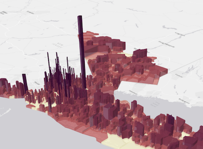

# 3D Visualization with the ArcGIS API for JavaScript

length: 30 min

presenters: Kristian Ekenes, Javier Gutierrez

July 12, 2017 11:00 am - 11:30 am

San Diego Convention Center, Tech Theater 17 Exhibit Hall A

## Summary

Learn how you can leverage modern browser technology and the ArcGIS API for JavaScript to build interactive 3D web applications.

### Demos

##### [Extrusion](https://ekenes.github.io/conferences/uc-2017/3d-viz/samples/extrusions/)

This sample demonstrates how to create a data-driven visualization with extrusions. It also demonstrates how to drive the height of cone object symbols based on numeric data and how adding color to visualize the same variable can help users interpret data more clearly in 3D.

##### [Points of interest](https://ekenes.github.io/conferences/uc-2017/3d-viz/samples/points-of-interest/)

This sample demonstrates how to add points of interest as icon symbols to a web scene. It takes advantage of symbol callouts and alters the size of icons based on their distance from the view's camera.

##### [Data exploration with Smart Mapping](https://ekenes.github.io/conferences/uc-2017/3d-viz/samples/smart-mapping/)

This sample shows how to create a data exploration app using the Smart Mapping APIs. It allows you to visualize buildings in New York geoenriched with housing data. You can also colorize features using themes in the color generators provided by Smart Mapping.

##### [Bivariate Smart Mapping](https://ekenes.github.io/conferences/uc-2017/3d-viz/samples/smart-mapping/bivariate.html)

This sample demonstrates how to create a bivariate data exporation app, allowing users to alter the size and color of features to explore potential correlation between two variables.

##### [Colorized buildings](https://ekenes.github.io/conferences/uc-2017/3d-viz/samples/types/)

This sample demonstrates how to colorize buildings by adding color to building textures or replacing textures altogether with color on plain mesh symbols.

##### [Highlight by type](https://ekenes.github.io/conferences/uc-2017/3d-viz/samples/types/highlight.html)

This sample demonstrates how to generate unique types based on a field using the type generators in the Smart Mapping APIs and highlight buildings when the user hovers over the generated type in a simple HTML list element.

##### [Thematic callouts](https://ekenes.github.io/conferences/uc-2017/3d-viz/samples/thematic-callout/)

This sample demonstrates how to create a continous size visualization with points and callouts on a global scale.

## Resources

* [Community](https://developers.arcgis.com/en/javascript/jshelp/community.html)
* [ArcGIS for JavaScript API Resource Center](http://help.arcgis.com/en/webapi/javascript/arcgis/index.html)
* [ArcGIS Blog](http://blogs.esri.com/esri/arcgis/)
* [twitter@esri](http://twitter.com/esri)

## Issues

Find a bug or want to request a new feature?  Please let us know by submitting an issue.

## Contributing

Esri welcomes contributions from anyone and everyone. Please see our [guidelines for contributing](https://github.com/esri/contributing).

## Licensing
Copyright 2016 Esri

Licensed under the Apache License, Version 2.0 (the "License");
you may not use this file except in compliance with the License.
You may obtain a copy of the License at

   http://www.apache.org/licenses/LICENSE-2.0

Unless required by applicable law or agreed to in writing, software
distributed under the License is distributed on an "AS IS" BASIS,
WITHOUT WARRANTIES OR CONDITIONS OF ANY KIND, either express or implied.
See the License for the specific language governing permissions and
limitations under the License.

A copy of the license is available in the repository's [license.txt](license.txt) file.

