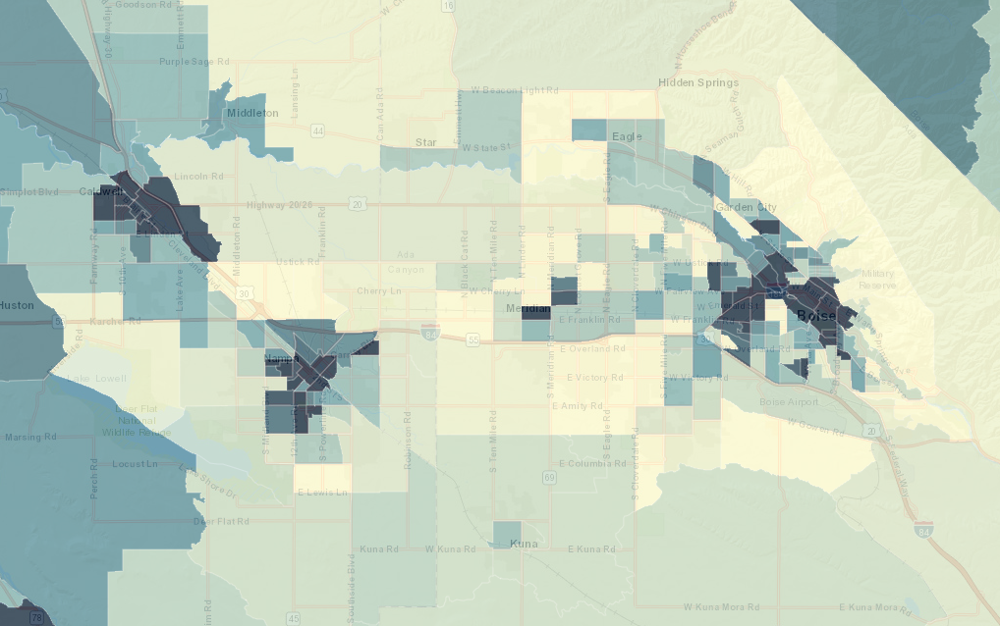
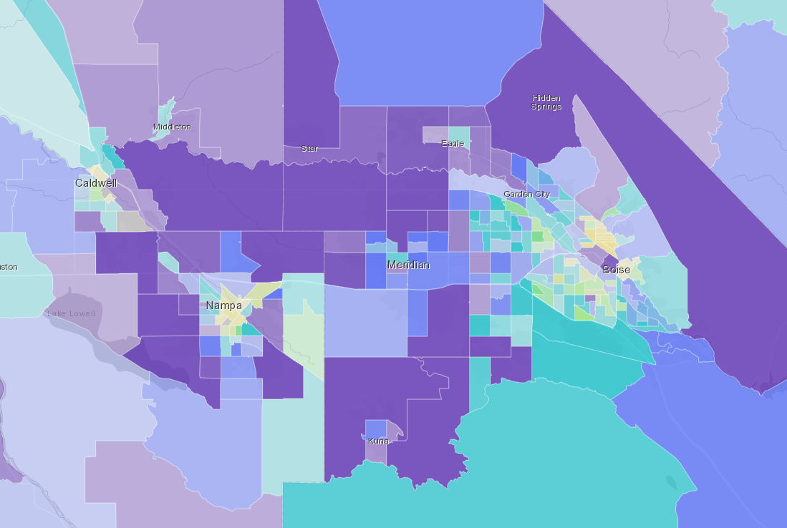
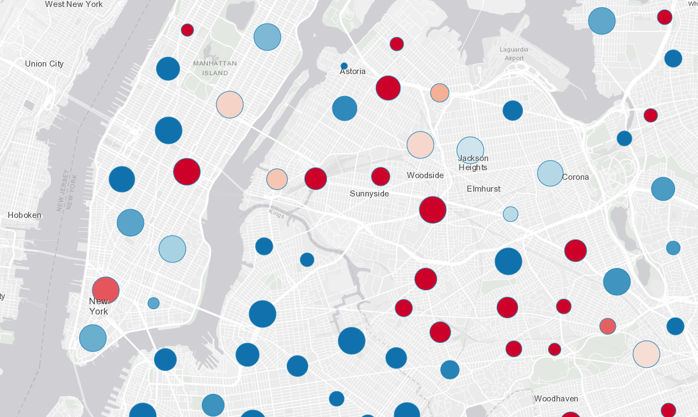
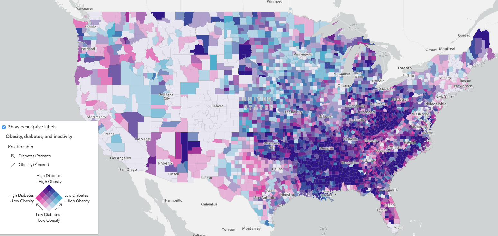
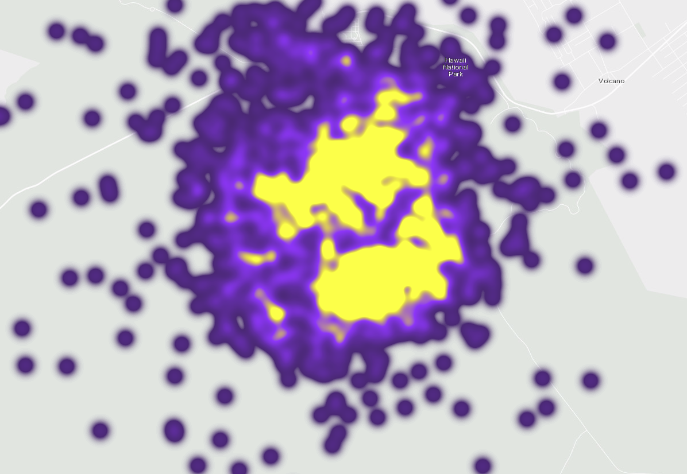
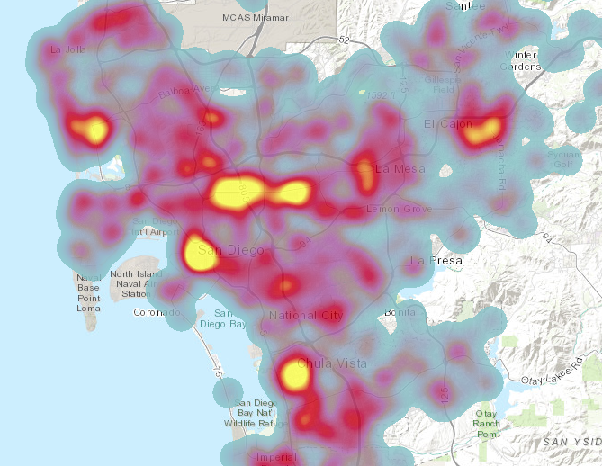
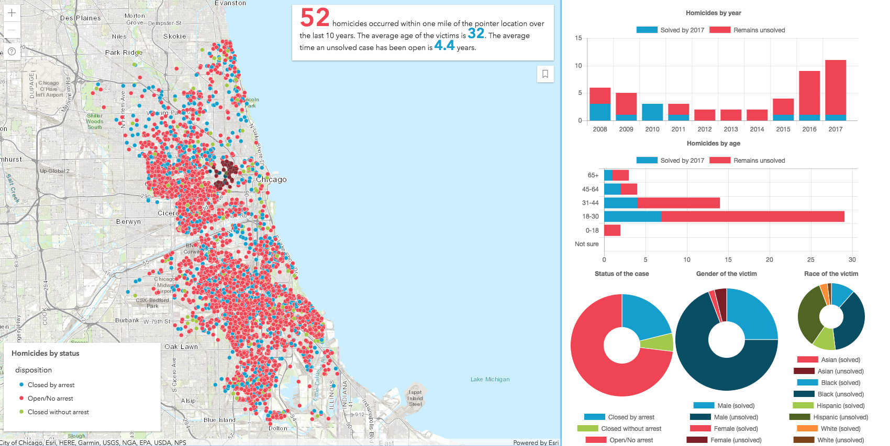

# ArcGIS API for JavaScript: 2D Visualization

Length: 60 min

Presenters: Kristian Ekenes, Jeremy Bartley

July 12, 2018 8:30 am - 9:30 am

San Diego Convention Center, Room 33C

## Summary

The ArcGIS API for JavaScript lets you build powerful interactive mapping applications. Learn how you can turn your raw data into information with simple layer styling, rich pop-up windows, and interactive data-driven visualizations.

### Demos

Fast feature layer symbol updates
Basic app with visual variables
smart mapping sample
Clustering
client-side querying
population pyramid
homicide data
Arcade
Arcade-based renderers
relationship renderer
predominance
volcano app

##### [Continuous size: Worldwide earthquakes](https://ekenes.github.io/conferences/uc-2018/2d-viz/samples/1-earthquakes/)

This sample demonstrates how to create a continuous size visualization on a point layer to visualize worldwide earthquakes by magnitude.

##### [Continuous color: Boise Housing](https://ekenes.github.io/conferences/uc-2018/2d-viz/samples/1-visual-variables/)

This sample demonstrates how to create a continuous color visualization by shading fill symbols based on a numeric attribute. This app visualizes housing statistics in the Boise, Idaho area.

##### [Predominance with Arcade: Boise housing by year built](https://ekenes.github.io/conferences/uc-2018/2d-viz/samples/3-predominance/)

This sample uses an Arcade expression to visualize the predominant decade housing units were built in the Boise, Idaho area.

##### [Multivariate visualization: 2016 U.S. presidential election](https://ekenes.github.io/conferences/uc-2018/2d-viz/samples/2-multivariate/)

This sample demonstrates how to create a multivariate visualization using several variables related to the 2016 U.S. presidential election. The color indicates the winner (or predominant vote-getter). Opacity indicates the margin of victory. Size indicates the total number of votes cast in the county.

##### [Smart mapping for data exploration](https://ekenes.github.io/conferences/uc-2018/2d-viz/samples/2-smart-mapping/)

This sample demonstrates how to create a data exploration app using the Smart Mapping APIs. You can use the slider widgets to modify the visualization based on variables related to the 2012 election.

##### [Clustering: 311 calls in NYC](https://ekenes.github.io/conferences/uc-2018/2d-viz/samples/4-clustering/)

This sample demonstrates how to create an app for exploring 311 calls in New York City using Arcade expressions and point clustering.

##### [Relationship](https://ekenes.github.io/conferences/uc-2018/2d-viz/samples/5-relationship/)

This sample demonstrates how to create a data exploration app using the Smart Mapping APIs. You can use the slider widgets to modify the visualization based on variables related to the 2012 election.

##### [Heatmap](https://developers.arcgis.com/javascript/latest/sample-code/visualization-heatmap/index.html)

This sample demonstrates how to create a heatmap visualization using live earthquake data.

##### [Scale-dependent heatmap](https://developers.arcgis.com/javascript/latest/sample-code/visualization-heatmap-scale/index.html)

This sample demonstrates how to create a scale-dependent heatmap, where the heatmap transitions to discrete points as you zoom to larger scales.

##### [Query statistics client-side by distance](https://developers.arcgis.com/javascript/latest/sample-code/featurelayerview-query-distance/index.html)

This sample demonstrates how to query for statistics in a FeatureLayerView by distance and display the results of the query in a series of charts.

This app displays homicide data from 50 U.S. cities between 2007 and 2017. The data was gathered and analyzed by [The Washington Post](https://www.washingtonpost.com/graphics/2018/investigations/unsolved-homicide-database/) and is [available for download here](https://github.com/washingtonpost/data-homicides).

## Resources

* [Community](https://developers.arcgis.com/en/javascript/jshelp/community.html)
* [ArcGIS for JavaScript API Resource Center](http://help.arcgis.com/en/webapi/javascript/arcgis/index.html)
* [ArcGIS Blog](http://blogs.esri.com/esri/arcgis/)
* [twitter@kekenes](http://twitter.com/kekenes)
* [twitter@ArcGIS JavaScript](http://twitter.com/ArcGISJSAPI)
* [twitter@esri](http://twitter.com/esri)

## Issues

Find a bug or want to request a new feature?  Please let us know by submitting an issue.

## Contributing

Esri welcomes contributions from anyone and everyone. Please see our [guidelines for contributing](https://github.com/esri/contributing).

## Licensing
Copyright 2016 Esri

Licensed under the Apache License, Version 2.0 (the "License");
you may not use this file except in compliance with the License.
You may obtain a copy of the License at

   http://www.apache.org/licenses/LICENSE-2.0

Unless required by applicable law or agreed to in writing, software
distributed under the License is distributed on an "AS IS" BASIS,
WITHOUT WARRANTIES OR CONDITIONS OF ANY KIND, either express or implied.
See the License for the specific language governing permissions and
limitations under the License.

A copy of the license is available in the repository's [license.txt](license.txt) file.

