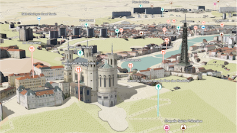
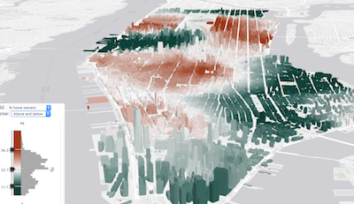
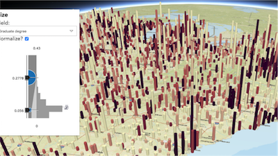
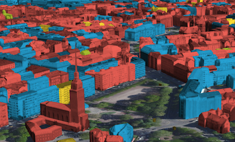

# ArcGIS API for JavaScript: 3D Visualization

length: 60 min

presenters: Kristian Ekenes, Johannes Schmid

July 12, 2018 10:00 am - 11:00 am

San Diego Convention Center, Room 33C

## Summary

The ArcGIS API 4.x for JavaScript provides a set of APIs allowing you to build powerful interactive 3D mapping applications. In this session, we'll focus on the visualization capabilities specific to 3D views. You'll learn cartographic techniques unique to 3D and see several demos showing how to thematically visualize 2D features with 3D symbols. We'll also provide an overview of how to visualize data in layers specific to 3D layers and web scenes.

### Demos

##### [Extrusion](https://ekenes.github.io/conferences/uc-2018/3d-viz/samples/extrusions/)

This sample demonstrates how to create a data-driven visualization with extrusions. It also demonstrates how to drive the height of cone object symbols based on numeric data and how adding color to visualize the same variable can help users interpret data more clearly in 3D.

##### [Points of interest](https://ekenes.github.io/conferences/uc-2018/3d-viz/samples/points-of-interest/)

This sample demonstrates how to add points of interest as icon symbols to a web scene. It takes advantage of symbol callouts and alters the size of icons based on their distance from the view's camera.

##### [Data exploration with Smart Mapping](https://ekenes.github.io/conferences/uc-2018/3d-viz/samples/smart-mapping/)

This sample shows how to create a data exploration app using the Smart Mapping APIs. It allows you to visualize buildings in New York geoenriched with entery data. You can also colorize features using themes in the color generators provided by Smart Mapping.

##### [Bivariate Smart Mapping](https://ekenes.github.io/conferences/uc-2018/3d-viz/samples/smart-mapping/bivariate.html)

This sample demonstrates how to create a bivariate data exporation app, allowing users to alter the size and color of features to explore potential correlation between two variables.

##### [Edge rendering](http://raluca-nicola.net/edge-rendering/?scene=touristic)

##### [Colorized buildings](https://ekenes.github.io/conferences/uc-2018/3d-viz/samples/types/)

This sample demonstrates how to colorize buildings by adding color to building textures or replacing textures altogether with color on plain mesh symbols.

##### [Underground visualization](https://developers.arcgis.com/javascript/latest/sample-code/sceneview-underground/index.html)

##### [Airspace encroachment analysis](https://ekenes.github.io/conferences/uc-2018/3d-viz/samples/airspace-encroachment /)

##### [Background Color](https://developers.arcgis.com/javascript/latest/sample-code/sceneview-background/index.html)

##### [Transparent ground](https://developers.arcgis.com/javascript/latest/sample-code/layers-scenelayer-points/index.html)

## Resources

* [Community](https://developers.arcgis.com/en/javascript/jshelp/community.html)
* [ArcGIS for JavaScript API Resource Center](http://help.arcgis.com/en/webapi/javascript/arcgis/index.html)
* [ArcGIS Blog](http://blogs.esri.com/esri/arcgis/)
* [twitter@kekenes](http://twitter.com/kekenes)
* [twitter@ArcGIS JavaScript](http://twitter.com/ArcGISJSAPI)
* [twitter@esri](http://twitter.com/esri)

## Issues

Find a bug or want to request a new feature?  Please let us know by submitting an issue.

## Contributing

Esri welcomes contributions from anyone and everyone. Please see our [guidelines for contributing](https://github.com/esri/contributing).

## Licensing
Copyright 2016 Esri

Licensed under the Apache License, Version 2.0 (the "License");
you may not use this file except in compliance with the License.
You may obtain a copy of the License at

   http://www.apache.org/licenses/LICENSE-2.0

Unless required by applicable law or agreed to in writing, software
distributed under the License is distributed on an "AS IS" BASIS,
WITHOUT WARRANTIES OR CONDITIONS OF ANY KIND, either express or implied.
See the License for the specific language governing permissions and
limitations under the License.

A copy of the license is available in the repository's [license.txt](license.txt) file.

